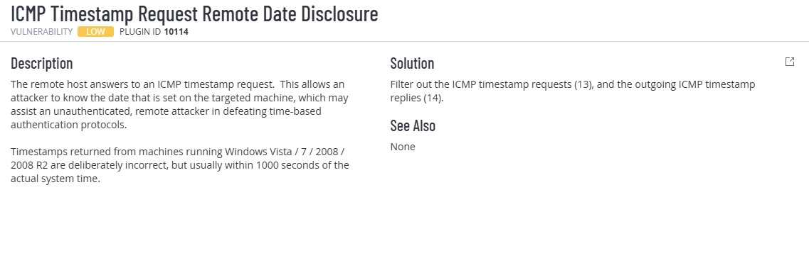
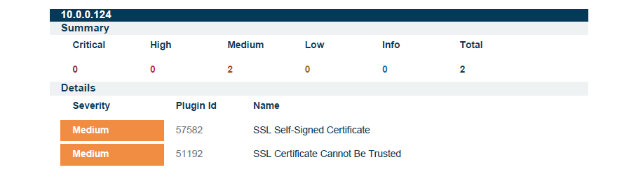

# ICMP Timestamp Request Mitigation (Windows Firewall) — Nessus Plugin 10114

This repository contains a PowerShell remediation + verification script that addresses Tenable/Nessus finding:

- **Plugin ID:** 10114  
- **Name:** ICMP Timestamp Request Remote Date Disclosure

The script mitigates the finding by ensuring the Windows Firewall is **enabled** (so rules are actually enforced) and by blocking:

- **Inbound** ICMPv4 Timestamp Requests (**Type 13**)  
- **Outbound** ICMPv4 Timestamp Replies (**Type 14**)

---

## Why this matters

ICMP timestamp responses can disclose a target system’s time to unauthenticated remote users.  
While this is typically a **low severity** finding, time disclosure can assist adversaries with reconnaissance and time-based attacks.

In real-world Windows environments, this finding commonly persists when:
- firewall rules exist, but **Windows Firewall is disabled**, meaning the rules aren’t enforced.

### Tenable Plugin Details



---

## Environment

- Target: Windows VM (tested on Windows Server 2025 Datacenter - x64 Gen2)
- PowerShell Version: 5.1
- Scan Type: Tenable / Nessus
- Privileges Required: Administrator

---

## What the script does

✅ Ensures it is run as **Administrator**  
✅ Captures a **true pre-mitigation baseline** (ICMP rule status + firewall profile status)  
✅ Ensures Windows Firewall is **enabled** if it was disabled (Domain / Private / Public profiles)  
✅ Creates or enforces firewall rules to block:
- ICMPv4 Type **13** (Inbound)
- ICMPv4 Type **14** (Outbound)

✅ Forces `gpupdate /force` and verifies the mitigation **still persists** afterward  
✅ Supports rollback:
- Removes the ICMP timestamp rules
- Restores firewall profile enabled/disabled state back to the original baseline
- Prints firewall status before/after restore

✅ Optional reboot prompt at the end (useful for clean rescans)

Script location:

[`scripts/Set-IcmpTimestampFiltering.ps1`](scripts/Set-IcmpTimestampFiltering.ps1)

---

## Firewall rules created

- **Inbound:** Block ICMPv4 Timestamp Request (Type 13)  
- **Outbound:** Block ICMPv4 Timestamp Reply (Type 14)

These are applied with Profile = `Any` to ensure scanner consistency.

---

## Usage

1. Open **PowerShell as Administrator**
2. (Optional) Edit the toggle inside the script:
   - `$secureEnvironment = $true`  → enforce mitigation (recommended)
   - `$secureEnvironment = $false` → rollback (remove mitigation + restore firewall baseline)
3. Run:

```powershell
.\scripts\Set-IcmpTimestampFiltering.ps1
```

---
## Technical Validation

The script validates remediation by:

- Showing firewall profile states **before and after**
- Confirming the rules exist in the effective firewall policy
- Forcing **Group Policy refresh** (`gpupdate /force`)
- Re-checking rules and firewall state after policy application
- Returning standard exit codes (`0` = success)

---

## Evidence (Before vs After)

### Before Remediation

Plugin **10114** present (ICMP Timestamp Request Remote Date Disclosure).  
Total findings: **3**


---

### After Remediation

Plugin **10114** removed.  
Total findings reduced: **3 → 2**



---

## Outcome

- Removed **Low severity** Nessus Plugin **10114**
- Reduced overall vulnerability count
- Automated remediation with baseline capture + verification
- GPO refresh included to detect/withstand policy overrides
- Compatible with Windows PowerShell 5.1

---

## Notes

- A reboot is typically not required, but can help ensure clean scanner results in lab environments.
- If the finding persists, confirm:
  - Windows Firewall is enabled on the active profile
  - The scan is targeting the correct IP/interface
  - The scan is re-run (not cached)
